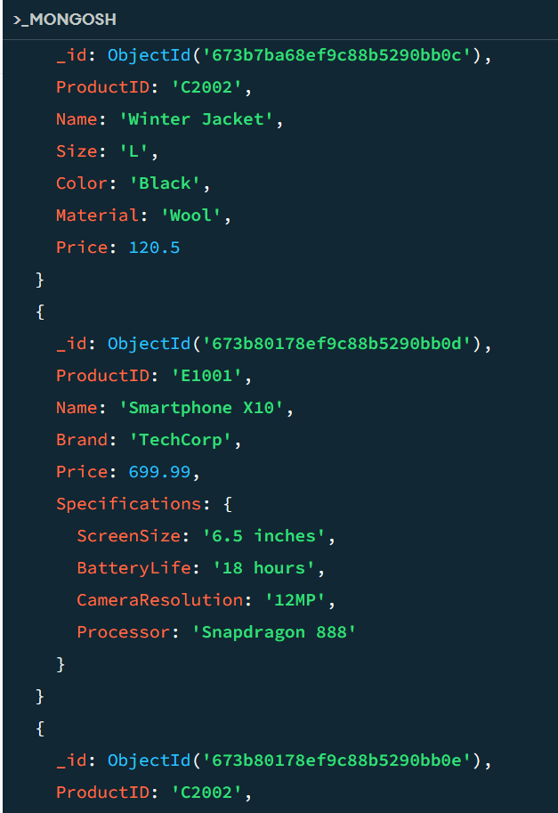

# LAB FOR WEEK THREE

## TechCorp Tech Company

## Task Performed
**1. Analyze TechCorp's Existing Table:**
   - The table was normalized to 3NF to reduce redundancy.
   - Design a relational schema from a single-table database.
   - Implement ACID-compliant transactions to maintain data integrity.
   - Apply concurrency control techniques to handle simultaneous transactions safely.
  
**2. Create MongoDB account and stores data into a newly created database**

## Tools Used:
- NoSQL (MongoDB)
- SQL (PostgreSQL)
- [Draw.io](https://draw.io) (for diagrams)

## UI
Creating MongoDB account and adding `ProductCatalog` database and `Product` collection

